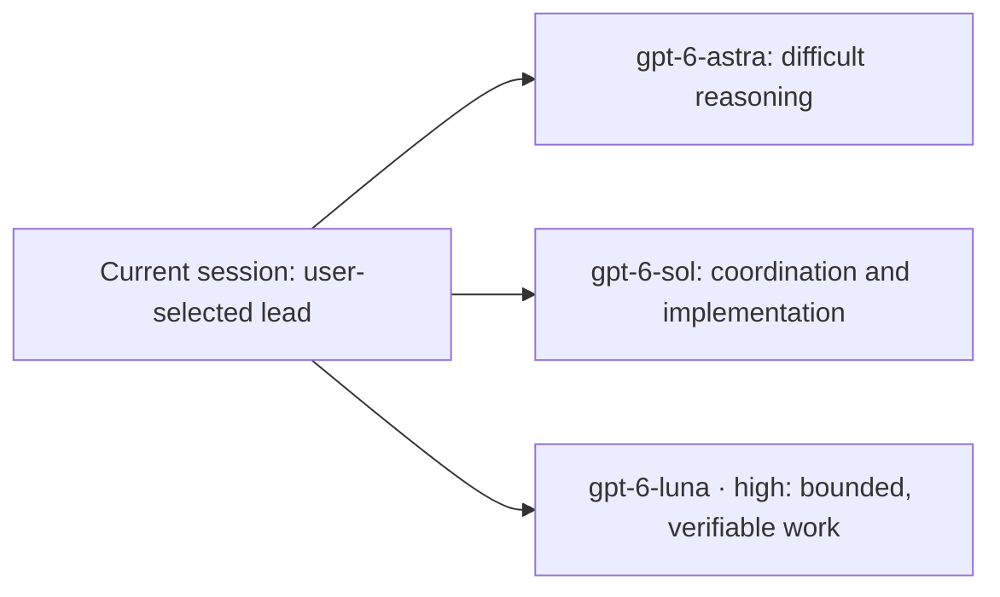

# Adaptive Model Orchestrator

[English](README.md) | [简体中文](README.zh-CN.md)



Adaptive Model Orchestrator is a Codex skill that routes work across gpt-6-astra, gpt-6-sol, and gpt-6-luna according to task complexity, parallelizability, dependencies, and verification risk. The current session first understands the request and remains on the user's selected model.

It is built around one rule: **use useful parallel work to improve overall delivery, while accounting for coordination cost**.

**Invest a little more judgment upfront. Aim for less rework later.**

For complete projects, long autonomous tasks, and deliveries that should need less supervision, the skill first decides whether delegation is worthwhile. It then assigns work according to readiness, ownership, and expected benefit, and supplies context according to each task. The goal is fewer avoidable handoffs and repeated implementations, shorter delivery cycles, and more reliable results through integrated validation.

Coordination can add upfront analysis, context transfer, and verification costs. Create branches only when the expected benefit outweighs that overhead. More agents do not necessarily use fewer tokens, and a cheaper model does not necessarily consume fewer tokens. Time, cost, and quality improvements are design goals, not measured guarantees; no quantitative comparison is currently published.

## Updated: useful parallel work and dependency-aware waiting

- **Keep the lead agent productive**: after delegation, the lead continues independent work with clear ownership. It can wait when no useful, safe work is ready; it does not invent work to stay busy.
- **Dispatch ready tasks together**: independent tasks with a clear expected benefit can start concurrently within the host's available capacity. One level of branches does not mean one subagent, and there is no fixed team size.
- **Use results as dependencies become ready**: check each stable handoff at an appropriate stopping point and unlock its consumers without waiting for unrelated branches. A progress message or intermediate file alone is not a ready dependency.
- **Avoid duplicate work and conflicting edits**: the lead follows the same single-editor boundaries as subagents. Taking over requires the original editor to stop and hand off its work. A broad module name does not make disjoint work conflict.
- **Keep review proportional**: use targeted integration checks as results arrive and validate the final whole. Add an independent reviewer only when its expected value outweighs the handoff and coordination cost.

See the [2026-09-23 change notes](CHANGELOG.md#2026-09-23) for the current model mapping. The [migration validation report](tests/migration-2026-09-23/VALIDATION.md) records its checks and limits; earlier results remain historical.

Complete projects, long autonomous work, and requests for less supervision prompt a collaboration assessment, not automatic delegation. Focused execution gets focused context; decisions about intent, architecture, or the overall result retain original requirements and relevant history. These decisions load with the skill. No additional global `AGENTS.md` rule is needed. Automatic selection still depends on the host, description, and task context; invoke the skill explicitly when you want to ensure it is selected.

## The problem it solves

```text
Without routing
every task → strongest model or unnecessary parallel agents

With adaptive routing
simple work          → current session
complex planning     → Astra
coordination         → Sol · medium/high
implementation       → Sol · medium/high (xhigh when needed)
bounded routine work → Luna · high
integrated review    → Sol, then Astra when the risk warrants it
```

Hard work is not automatically parallel work. The skill creates branches only when they can progress independently and return verifiable results.

## How it routes work

| Task shape | Execution strategy |
|---|---|
| A clear path with no worthwhile independent subtask | Complete it in the current session |
| Multiple tightly coupled steps | Keep one coordinator; delegate only independent research or checks |
| Multiple independently verifiable deliverables | Dispatch ready, non-conflicting tasks concurrently when worthwhile; the lead advances its own work |
| One difficult, indivisible reasoning problem | Let Astra solve the core problem and optionally add an independent review |

Default roles:

- **gpt-6-astra** — difficult reasoning, architecture, conflicting constraints, and high-risk final validation; its role is unchanged.
- **gpt-6-sol** — requirements, coordination, communication, implementation, tool use, code, files, complex layouts, integration, and cross-module review. Use `medium` or `high`, and `xhigh` when needed.
- **gpt-6-luna** — bounded, low-risk tasks with clear checks; always use `high` reasoning.

These are routing defaults, not a requirement to use every model or create a separate agent for each role. Model consolidation does not merge independent reviewer and fixer roles. The lead can combine execution and coordination when independence is not required. The active environment and user authorization always determine what can actually run.

## Routing example

User request:

```text
Build and review a full-stack authentication system.
```

Possible orchestration:

1. The lead establishes stable interfaces and acceptance criteria, drawing on **Astra · high** for difficult architecture or security decisions when needed.
2. Once those inputs are ready, disjoint backend and frontend work can run concurrently with **gpt-6-sol · medium/high**. Use `xhigh` for unusually difficult implementation. The lead advances independent deployment configuration or integration preparation within its own editing scope.
3. Bounded, low-risk documentation or routine checks can go to **gpt-6-luna · high** when their inputs are ready and delegation is worthwhile; spare capacity alone is not a reason to create a branch.
4. As stable results arrive, the lead checks each handoff and starts the work it unblocks. It waits when all remaining useful work is genuinely blocked, without duplicating an active implementation.
5. The integrated system receives final validation. **Sol** and **Astra** remain the preferred routes for ordinary and difficult reviews; the lead may combine roles, and a separate reviewer is added only when the expected value justifies it.

If the core problem is indivisible and a subagent is better placed to solve it, the lead may delegate that work and wait. The skill does not manufacture parallelism.

## Install

Clone the repository into your local Codex skills directory:

```bash
git clone https://github.com/chips-lxm/adaptive-model-orchestrator.git ~/.codex/skills/adaptive-model-orchestrator
```

Start a new Codex conversation after installation. The skill can be selected automatically from its description or invoked explicitly:

```text
Use $adaptive-model-orchestrator to coordinate useful parallel work, wait when dependencies require it, and validate the integrated result.
```

For an existing Git-based installation, preserve any local customizations, then update with:

```bash
git -C ~/.codex/skills/adaptive-model-orchestrator pull --ff-only
```

For a manually copied installation, back up customizations and replace `SKILL.md`, `agents/openai.yaml`, and `references/collaboration-and-validation.md` together from the same revision.

## What is included

```text
adaptive-model-orchestrator/
├── SKILL.md
├── agents/openai.yaml
└── references/collaboration-and-validation.md
```

- `SKILL.md` contains routing decisions, model roles, constraints, and completion criteria.
- `references/collaboration-and-validation.md` contains handoff fields, state tracking, escalation, and review rules.
- `agents/openai.yaml` provides Codex-facing display metadata and a default prompt.

## Design principles

- Do not split work merely because it is difficult or has many steps.
- Keep one lead responsible for requirements, dependencies, integration, and acceptance, while also advancing useful independent work.
- Give each file or shared artifact one active editor at a time, including the lead; hand over ownership before taking over edits.
- Validate the integrated result, not just each branch in isolation.
- Report only confirmed model and reasoning settings; mark unavailable fields as unknown instead of treating requested settings as confirmed execution.
- Stop when the acceptance criteria are met.

## License

[MIT](LICENSE)
