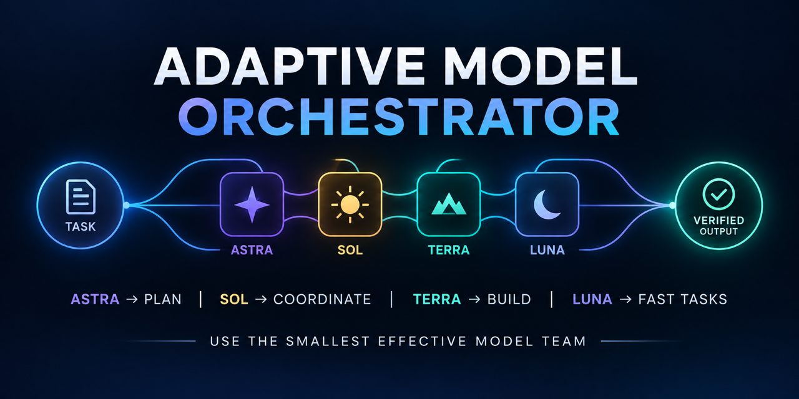

# 自适应多模型编排器

[English](README.md) | [简体中文](README.zh-CN.md)



Adaptive Model Orchestrator 是一个 Codex Skill：根据任务难度、可并行性、依赖关系和验收风险，在 Astra、Sol、Terra 与 Luna 之间选择最小有效协作配置。

**前期多一点判断，后期少一些返工。**

面向完整项目、自主长任务和希望减少监督的交付，先判断哪些工作值得分工，再按任务难度和背景需求组织最小有效模型团队。目标是减少无效往返与重复实现，缩短交付周期，并通过整体验收提高交付可靠性。

协作可能增加前期分析、上下文传递和验证成本。只有预计收益超过这些开销时才创建分支；更多子智能体不等于更省 Token，较便宜的模型也不等于更少用量。时间、费用与质量收益是设计目标，目前没有量化对照数据，不作固定节省或质量保证。

## 本次改进：更准确地判断何时协作

- **更贴近自主交付的触发场景**：完整项目、长时间自主执行和减少监督的请求，都应进入协作评估；读取技能不等于必须创建分支。
- **以总成本决定分工**：从最少必要分支开始，计入交接、协调、验证和返工开销；有独立工作和明确收益时再增加。
- **按任务提供背景**：局部执行可以精简，涉及用户意图、架构和整体评价时则提供用户原话、关键纠正与决策，必要时继承完整相关历史。

这些判断保留在技能中按需读取，无需新增每一步必读的全局 `AGENTS.md` 规则。自动匹配仍取决于宿主、技能描述和当前上下文；需要明确使用时，可以直接点名技能。

## 它解决什么问题

```text
没有路由
所有任务 → 最强模型，或没有实际价值的并行分支

使用自适应路由
简单工作         → 当前会话
复杂方案         → Astra
协调与集成       → Sol
代码和文件实现   → Terra
边界明确的机械任务 → Luna
整体验收         → Sol；高风险部分再由 Astra 复核
```

困难任务不自动等于并行任务。只有子任务可以独立推进并返回可验证结果时，Skill 才创建分支。

## 路由规则

| 任务形态 | 执行方式 |
|---|---|
| 单一目标、路径明确 | 当前会话直接完成 |
| 多个步骤但依赖紧密 | 由一个负责人统筹，只拆出独立资料或检查任务 |
| 多个可独立交付并验证的部分 | 建立少量分支，明确负责人、依赖和验收标准 |
| 困难但不可拆分的核心问题 | 由 Astra 集中解决，必要时增加独立复核 |

默认职责：

- **Astra**：困难推导、整体方案、关键约束冲突与高风险最终验收。
- **Sol**：需求整理、协作协调、内容表达、结果集成与跨模块检查。
- **Terra**：工具操作、代码、文件制作和复杂布局。
- **Luna**：规则明确、边界清晰且容易核对的任务；推理强度始终不低于 `medium`。

这些只是默认路由，不要求每个任务使用所有模型。最终安排始终服从实际环境能力和用户授权。

## 完整示例

用户输入：

```text
构建并审查一个全栈身份认证系统。
```

可能的编排结果：

1. **Astra · high** 确定架构、威胁模型、接口和验收标准。
2. **Sol · medium** 把方案整理为有负责人和依赖关系的任务计划，并协调集成。
3. **Terra · medium/high** 在修改范围互不冲突时，实现后端、前端和配置工作。
4. **Luna · medium** 完成清单整理、文档和规则明确的检查任务。
5. **Sol · high** 检查集成与常规缺陷；**Astra · high** 复核安全决策和最终系统。

如果任务无法安全拆分，Skill 会保留单一执行分支，不为并行而并行。

## 安装

```bash
git clone https://github.com/chips-lxm/adaptive-model-orchestrator.git ~/.codex/skills/adaptive-model-orchestrator
```

安装后开启新的 Codex 对话。Skill 可以根据描述自动匹配，也可以显式调用：

```text
使用 $adaptive-model-orchestrator，以最小有效模型团队协调这个任务。
```

## 项目结构

```text
adaptive-model-orchestrator/
├── SKILL.md
├── agents/openai.yaml
└── references/collaboration-and-validation.md
```

- `SKILL.md`：路由决策、模型职责、约束和完成标准。
- `references/collaboration-and-validation.md`：交接字段、状态管理、升级和验收规则。
- `agents/openai.yaml`：Codex 界面元数据和默认提示词。

## 设计原则

- 不因为任务困难或步骤多就强行拆分。
- 始终保留一个总负责人维护需求、依赖、集成和验收。
- 同一文件或模块同一时间只指定一个修改负责人。
- 验证集成后的整体结果，而不是只看各分支分别通过。
- 只报告实际使用的模型和推理强度，不虚构模型切换。
- 达到验收标准后停止。

## 许可证

[MIT](LICENSE)
