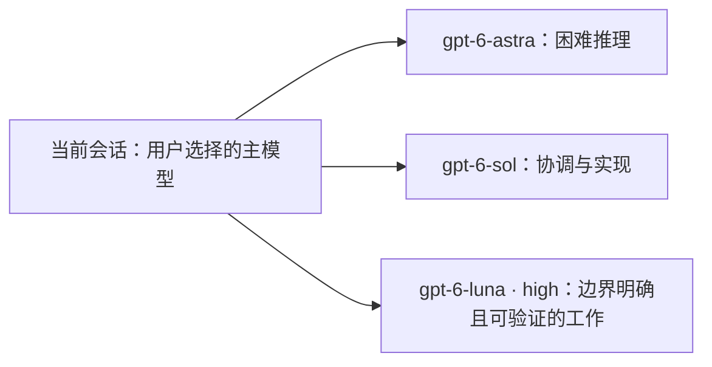

# 自适应多模型编排器

[English](README.md) | [简体中文](README.zh-CN.md)



Adaptive Model Orchestrator 是一个 Codex Skill：根据任务难度、可并行性、依赖关系和验收风险，在 gpt-6-astra、gpt-6-sol 与 gpt-6-luna 之间组织有实际收益的协作，同时权衡整体交付效率与协调成本。当前会话先理解用户要求，并保持用户选定的主模型。

**前期多一点判断，后期少一些返工。**

面向完整项目、自主长任务和希望减少监督的交付，先判断哪些工作值得分工，再按任务难度、就绪情况、修改边界和背景需求安排主智能体与分支的工作。目标是减少无效往返与重复实现，缩短交付周期，并通过整体验收提高交付可靠性。

协作可能增加前期分析、上下文传递和验证成本。只有预计收益超过这些开销时才创建分支；更多子智能体不等于更省 Token，较便宜的模型也不等于更少用量。时间、费用与质量收益是设计目标，目前没有量化对照数据，不作固定节省或质量保证。

## 本次改进：并行推进与按依赖等待

- **主智能体也承担实际工作**：派发后继续推进修改边界明确的独立工作；没有安全且有收益的工作时允许等待，不为保持忙碌增加无关任务。
- **已就绪任务可以同时派发**：独立、互不冲突且有明确协作收益的任务，可在可用并发额度内同时启动。“一层分支”不等于一个子智能体，也不要求固定团队规模。
- **按依赖接收结果**：在合适的停顿点检查稳定交付，及时启动被它解锁的后续工作，无需等无关分支结束。进度消息或中间文件本身不代表前置产物已就绪。
- **避免重复实现和修改冲突**：主智能体与分支同样遵守单一修改负责人规则，接管前先停止原执行并交接。不能仅因同属一个业务模块，就把修改范围独立的工作串行化。
- **控制检查成本**：结果返回时先做相关集成检查，最终再验收整体；只有独立复核的预期价值超过交接与协调成本时，才另开验收分支。

当前模型映射见 [2026-09-23 更新说明](CHANGELOG.md#2026-09-23)。[迁移验证报告](tests/migration-2026-09-23/VALIDATION.md) 记录检查范围与限制；此前结果属于历史记录。

完整项目、自主长任务和减少监督的请求仍先评估协作收益，不会自动创建分支。局部执行使用必要背景；涉及意图、架构和整体结果的判断保留原始要求与相关历史。这些规则随 skill 按需读取，无需新增全局 `AGENTS.md` 规则。自动匹配仍取决于宿主、技能描述和当前上下文；需要明确使用时，可以直接点名技能。

## 它解决什么问题

```text
没有路由
所有任务 → 最强模型，或没有实际价值的并行分支

使用自适应路由
简单工作         → 当前会话
复杂方案         → Astra
协调与集成       → Sol · medium/high
代码和文件实现   → Sol · medium/high（必要时 xhigh）
边界明确的低风险任务 → Luna · high
整体验收         → Sol；高风险部分再由 Astra 复核
```

困难任务不自动等于并行任务。只有子任务可以独立推进并返回可验证结果时，Skill 才创建分支。

## 路由规则

| 任务形态 | 执行方式 |
|---|---|
| 路径明确且没有值得独立推进的子任务 | 当前会话直接完成 |
| 多个步骤但依赖紧密 | 由一个负责人统筹，只拆出独立资料或检查任务 |
| 多个可独立交付并验证的部分 | 有收益时同时派发已就绪且互不冲突的任务，主智能体同步推进自己的工作 |
| 困难但不可拆分的核心问题 | 由 Astra 集中解决，必要时增加独立复核 |

默认职责：

- **gpt-6-astra**：困难推导、整体方案、关键约束冲突与高风险最终验收；职责保持不变。
- **gpt-6-sol**：需求整理、协作协调、内容表达、工具操作、代码、文件制作、复杂布局、结果集成与跨模块检查。使用 `medium` 或 `high`，必要时使用 `xhigh`。
- **gpt-6-luna**：规则明确、边界清晰、低风险且容易核对的任务；始终使用 `high` 推理强度。

这些只是默认路由，不要求每个任务使用所有模型，也不要求每个角色单独开一个智能体。模型合并不等于合并必须独立的审查者与修复者职责；不要求独立性时，主智能体可以兼任执行与协调。最终安排始终服从实际环境能力和用户授权。

## 完整示例

用户输入：

```text
构建并审查一个全栈身份认证系统。
```

可能的编排结果：

1. 主智能体先明确稳定接口与验收标准；涉及困难架构或安全判断时，按需由 **Astra · high** 参与。
2. 前置输入就绪后，可由 **gpt-6-sol · medium/high** 同时推进修改范围互不冲突的后端和前端工作；特别困难的实现可用 `xhigh`。主智能体在自己的修改范围内同步完成独立的部署配置或集成准备。
3. 输入就绪且委派有收益时，可把边界明确、低风险的文档或常规检查交给 **gpt-6-luna · high**；不会仅因有空闲额度就创建分支。
4. 稳定结果返回后，主智能体检查交付并启动依赖已满足的后续工作；剩余有用工作都受阻时才等待，不重复实现正在执行的任务。
5. 集成后的系统仍需最终验收。常规与困难审查分别优先路由至 **Sol** 和 **Astra**；主智能体可以合并职责，只有预期收益足够时才另设验收分支。

核心问题不可拆分且分支更适合处理时，主智能体可以委派后等待，不强行制造并行工作。

## 安装

```bash
git clone https://github.com/chips-lxm/adaptive-model-orchestrator.git ~/.codex/skills/adaptive-model-orchestrator
```

安装后开启新的 Codex 对话。Skill 可以根据描述自动匹配，也可以显式调用：

```text
使用 $adaptive-model-orchestrator，协调有实际收益的并行工作，按依赖等待，并完成整体验收。
```

如果原来通过 Git 安装，先保留本地自定义修改，再更新：

```bash
git -C ~/.codex/skills/adaptive-model-orchestrator pull --ff-only
```

如果原来手动复制安装，先备份自定义内容，再从同一版本同步替换 `SKILL.md`、`agents/openai.yaml` 和 `references/collaboration-and-validation.md`。

## 项目结构

```text
adaptive-model-orchestrator/
├── SKILL.md
├── agents/openai.yaml
└── references/collaboration-and-validation.md
```

- `SKILL.md`：路由决策、模型职责、约束和完成标准。
- `references/collaboration-and-validation.md`：交接字段、状态管理、升级和验收规则。
- `agents/openai.yaml`：Codex 界面元数据和默认提示词。

## 设计原则

- 不因为任务困难或步骤多就强行拆分。
- 始终保留一个总负责人维护需求、依赖、集成和验收，同时推进有价值的独立工作。
- 同一文件或共享产物同一时间只有一个修改负责人，主智能体也遵守；接管前先交接修改权。
- 验证集成后的整体结果，而不是只看各分支分别通过。
- 只报告已确认的实际模型和推理强度；环境未提供的信息标为未知，不把请求配置当作实际配置。
- 达到验收标准后停止。

## 许可证

[MIT](LICENSE)
